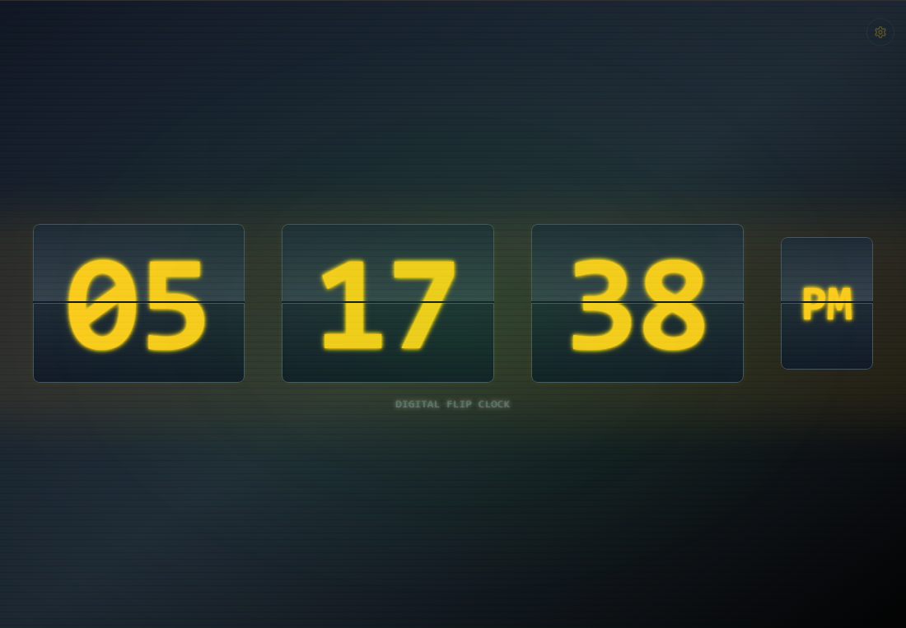
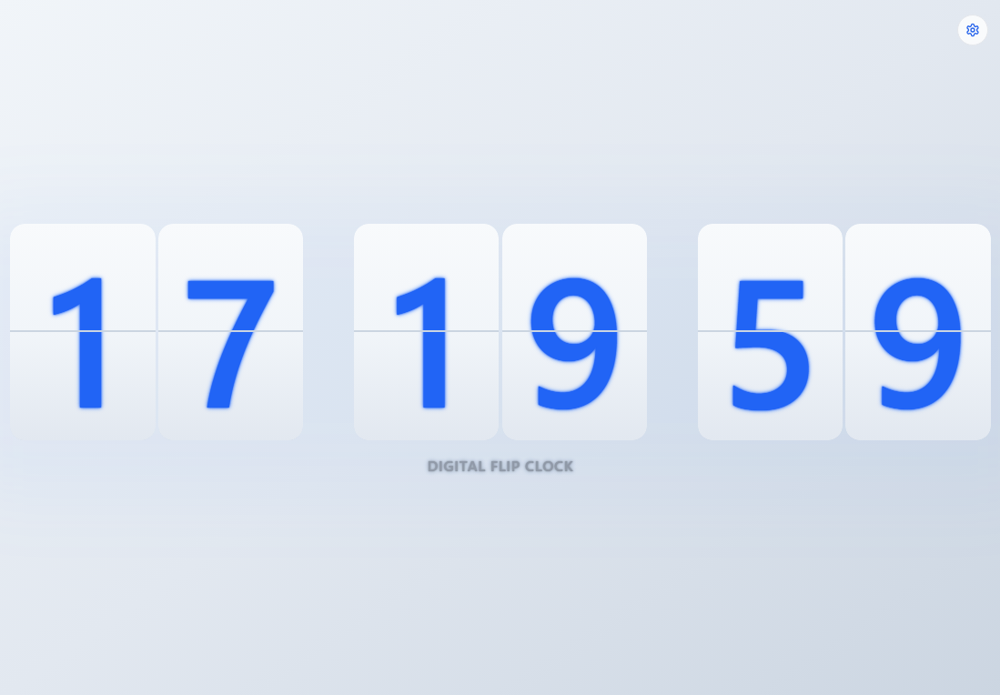
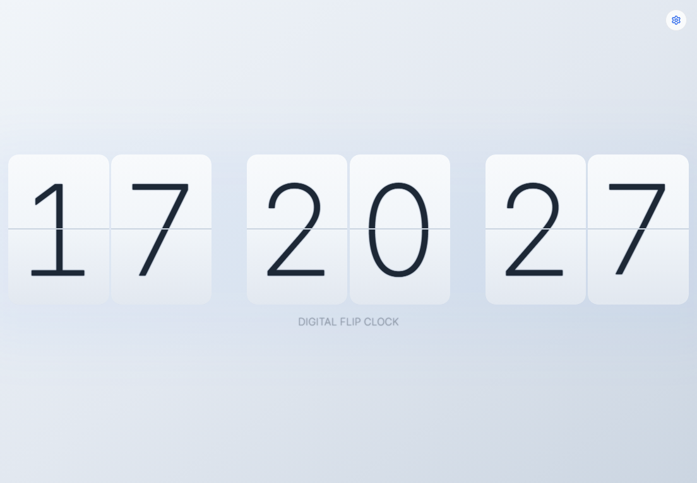
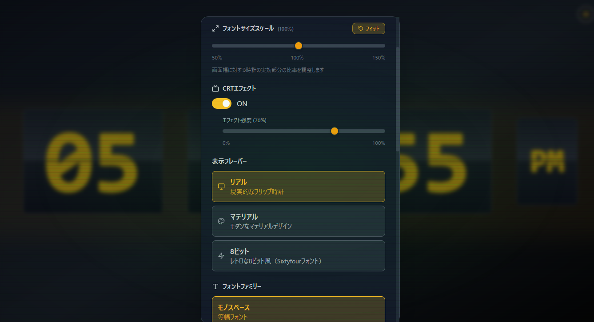
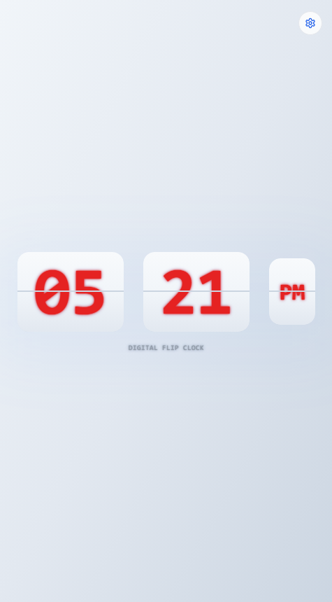

# Beautiful Flip Clock

美しいフリップ時計のWebアプリケーションです。レトロなデジタル時計のフリップ動作を再現し、リアルタイムで現在時刻を表示します。

## 📸 画面サンプル

### リアルモード（デフォルト）
現実的なフリップ時計の外観で、暖かみのあるアンバー色とグラデーション背景が特徴です。



### マテリアルモード
モダンなマテリアルデザインで、明るい背景とクリーンな外観が特徴です。



### モノクロームモード
1984年Macintosh風の2値モノクロ表示で、シンプルで機能的なデザインが特徴です。


### レトロコンピューターモード
Apple IIやCommodore 64風の極低解像度表示で、80年代のパーソナルコンピューターを再現します。


### ターミナルモード
古いテキストターミナルやコマンドプロンプト風のCLI表示で、開発者向けの機能的なデザインです。


### 細身フォント（シン・ウルトラシン）
Apple製品のようなエレガントで現代的な細身フォントによる洗練された表示です。



### 設定画面
豊富なカスタマイズオプションを提供する直感的な設定インターフェースです。



### レスポンシブデザイン
モバイルデバイスでも美しく表示される完全レスポンシブ対応です。



---

## 特徴

- **リアルタイム時計**: 秒単位で更新される正確な時刻表示
- **フリップアニメーション**: 数字が変わる際の滑らかなフリップ効果
- **レスポンシブデザイン**: モバイルからデスクトップまで対応
- **美しいUI**: グラデーションと影効果による洗練されたデザイン
- **アンビエントグロー**: 時計周辺の美しい光彩効果
- **ネットワークアクセス対応**: 同一ネットワーク内の他デバイスからアクセス可能
- **動的サイズ調整**: 画面サイズと表示要素数に応じた最適なフォントサイズ自動調整
- **豊富なカスタマイズ機能**: 
  - 時刻表示形式（12時間/24時間）
  - 秒表示のON/OFF
  - フリップ構成（一桁/二桁）
  - **フォントサイズスケール**: 50%〜150%の範囲で細かく調整可能
  - フォントカラー（6色）
  - **フォントファミリー（6種類）**: モノスペース、サンセリフ、セリフ、ピクセル、**シン、ウルトラシン**
  - **表示フレーバー（5種類）**: リアル、マテリアル、**モノクローム、レトロコンピューター、ターミナル**
  - **CRTエフェクト**: 本格的なブラウン管モニター風エフェクト（強度調整可能）
  - **フォントグロー**: 全モード対応の美しい発光効果
  - **画面明るさ調整**: 30%〜100%の範囲で調整可能
  - **CRT強度調整**: エフェクトの強度を0%〜100%で細かく調整

## デフォルト設定

アプリケーションは以下の設定で起動します：
- **時刻表示**: 12時間形式（AM/PM表示）
- **秒表示**: ON
- **フリップ構成**: 二桁フリップ
- **フォントサイズスケール**: 100%（画面フィット）
- **フォントカラー**: アンバー
- **表示フレーバー**: リアル
- **フォントファミリー**: モノスペース
- **CRTエフェクト**: ON
- **CRT強度**: 70%
- **フォントグロー**: ON
- **画面明るさ**: 100%

## 技術スタック

- **React 18** - モダンなUIライブラリ
- **TypeScript** - 型安全な開発
- **Tailwind CSS** - ユーティリティファーストのCSSフレームワーク
- **Vite** - 高速な開発サーバーとビルドツール

## セットアップ方法

### 前提条件

- Node.js (バージョン 16 以上)
- npm または yarn

### Ubuntu での起動方法

```bash
# Node.jsとnpmのインストール（未インストールの場合）
sudo apt update
sudo apt install nodejs npm

# プロジェクトのクローン
git clone <repository-url>
cd beautiful-flip-clock

# 依存関係のインストール
npm install

# 開発サーバーの起動
npm run dev
```

### macOS での起動方法

```bash
# Homebrewを使用してNode.jsをインストール（未インストールの場合）
brew install node

# プロジェクトのクローン
git clone <repository-url>
cd beautiful-flip-clock

# 依存関係のインストール
npm install

# 開発サーバーの起動
npm run dev
```

### 起動後のアクセス方法

開発サーバーが起動すると、以下の方法でアプリケーションにアクセスできます：

#### 1. ローカルアクセス
```
http://localhost:5173
```

#### 2. ネットワークアクセス（他デバイスから）
```
http://[あなたのIPアドレス]:5173
```

**IPアドレスの確認方法:**
- **Windows**: `ipconfig` コマンドを実行
- **macOS/Linux**: `ifconfig` または `ip addr show` コマンドを実行
- **簡単な方法**: 開発サーバー起動時のコンソールに表示される「Network」のURLを使用

**例:**
```
➜  Local:   http://localhost:5173/
➜  Network: http://192.168.1.100:5173/
```

これにより、同一ネットワーク内のスマートフォン、タブレット、他のPCからもアクセス可能です。

## 利用可能なスクリプト

- `npm run dev` - 開発サーバーの起動
- `npm run build` - プロダクション用ビルド
- `npm run preview` - ビルド結果のプレビュー
- `npm run lint` - ESLintによるコードチェック

## プロジェクト構造

```
src/
├── components/
│   ├── FlipClock.tsx         # メインの時計コンポーネント
│   ├── FlipDigit.tsx         # 個別の数字フリップコンポーネント
│   ├── FlipDoubleDigit.tsx   # 二桁フリップコンポーネント
│   └── SettingsModal.tsx     # 設定画面コンポーネント
├── hooks/
│   └── useSettings.ts        # 設定管理フック
├── types/
│   └── settings.ts           # 設定関連の型定義
├── App.tsx                   # アプリケーションのルートコンポーネント
├── main.tsx                  # エントリーポイント
└── index.css                 # グローバルスタイルとアニメーション
```

## カスタマイズ機能

### 設定画面の開き方
時計画面にマウスカーソルを合わせると、右上に設定ボタンが表示されます。

### 利用可能な設定

#### 🆕 フォントサイズスケール調整
- **スライダーバー**: 50%〜150%の範囲で細かく調整可能
- **リアルタイム表示**: 現在のスケールをパーセンテージで表示
- **フィットボタン**: ワンクリックで100%（画面フィット）に戻す
- **即座に反映**: 調整と同時に時計サイズが変化
- **画面比率調整**: 画面幅に対する時計の実効部分の比率を調整

#### 画面明るさ調整
- **スライダーバー**: 30%〜100%の範囲で調整可能
- **リアルタイム表示**: 現在の明るさをパーセンテージで表示
- **即座に反映**: 調整と同時に画面の明るさが変化

#### CRTエフェクト
本格的なブラウン管モニター風エフェクトを再現：
- **ON/OFF切り替え**: エフェクトの有効/無効を切り替え
- **強度調整**: 0%〜100%の範囲で細かく調整可能
- **動的制御**: 以下の要素が強度に応じて変化
  - **スキャンライン**: 荒い走査線エフェクト
  - **フリッカー**: 微細な画面のちらつき
  - **フォスファーグロー**: 蛍光体の発光効果
  - **画面ぼかし**: CRT特有の画面全体のぼかし
  - **ビネット効果**: 画面端の暗化
  - **アンビエントグロー**: 画面全体の発光効果
  - **🆕 球面歪み**: ブラウン管の球面ガラスを再現する3D変形
  - **🆕 膨らみ効果**: 中央の数字が手前に浮き出る立体表示
  - **🆕 樽型歪み**: 画面端に向かう微細な歪み効果

#### 🆕 表示フレーバー（5種類）
- **リアル**: 現実的なフリップ時計（デフォルト）
- **マテリアル**: モダンなマテリアルデザイン
- **🆕 モノクローム**: 1984年Macintosh風2値モノクロ表示
- **🆕 レトロコンピューター**: Apple II/Commodore 64風極低解像度表示
- **🆕 ターミナル**: 古いテキストターミナル・CLI風表示

##### 🌟 新フレーバーの特徴

**モノクロームモード**
- **デザイン**: 1984年Macintosh風の2値モノクロ表示
- **背景**: 明るいグレー背景に白いコンテナ
- **フォント**: Monaco/Menloベースのシャープなモノスペース
- **カラー**: 全て黒色で統一（フォントカラー設定無効）
- **エフェクト**: ピクセル感のあるシャープな表示

**レトロコンピューターモード**
- **デザイン**: Apple II/Commodore 64風の極低解像度表示
- **背景**: 深い青色背景にブルーのコンテナ
- **フォント**: Orbitronベースの太字ピクセルフォント
- **カラー**: 80年代コンピューター風の限定パレット
- **エフェクト**: ブルーグローと立体的なボーダー

**ターミナルモード**
- **デザイン**: 古いテキストターミナル・コマンドプロンプト風
- **背景**: 暗いグレー背景に黒いコンテナ
- **フォント**: Courier Newベースの古典的なCLIフォント
- **カラー**: CLI風の限定色（黄色、シアン、緑など）
- **エフェクト**: 控えめなグローと機能的なデザイン

#### フォントファミリー
- **モノスペース**: 等幅フォント（デフォルト）
- **サンセリフ**: モダンなゴシック体
- **セリフ**: クラシックな明朝体
- **ピクセル**: Orbitron 8ビット風フォント
- **🆕 シン**: Inter細身フォント（Myriad風の現代的デザイン）
- **🆕 ウルトラシン**: Roboto極細フォント（最もスタイリッシュ）

#### 🌟 新機能: 細身フォント
**シン・ウルトラシン**フォントは、Apple製品やモダンなデザインでよく使われるMyriad風の美しい細身フォントです：

##### 特徴
- **エレガント**: 洗練された現代的なタイポグラフィ
- **可読性**: 細身でも時計として十分な視認性
- **最適化**: アンチエイリアシング、カーニング、リガチャを適用
- **専用グロー**: 細身フォント専用の控えめで上品なグロー効果

##### 技術仕様
- **シン**: Inter 200 weight - バランスの取れた細身デザイン
- **ウルトラシン**: Roboto 100 weight - 極細で軽やかな印象
- **フォント機能**: タブラー数字、最適化されたレンダリング
- **互換性**: 全ての表示フレーバーとCRTエフェクトに対応

#### フォントグロー
全ての表示フレーバーとフォントファミリーで利用可能な美しい発光効果：
- **リアル・マテリアル**: 従来通りの美しいグロー効果
- **🆕 モノクローム**: シャドウ効果による立体感
- **🆕 レトロコンピューター**: ブルーグローによる80年代風効果
- **🆕 ターミナル**: 控えめなCLI風グロー効果

#### 時刻表示形式
- 秒の表示/非表示を切り替え可能
- **一桁フリップ**: 各桁が個別にフリップ
- **二桁フリップ**: 時・分・秒が一体でフリップ（デフォルト）

#### フォントカラー
- **アンバー**: 暖かみのあるオレンジ色（デフォルト）
- **ブルー**: クールな青色
- **グリーン**: 自然な緑色
- **レッド**: 鮮やかな赤色
- **パープル**: 上品な紫色
- **ホワイト**: クリーンな白色

*注意: モノクロームモードでは黒色固定となります*

### 動的サイズ調整機能
- **画面サイズ対応**: ウィンドウサイズに応じて時計サイズが自動調整
- **要素数最適化**: 表示要素数（秒表示、AM/PM表示）に応じてフォントサイズが最適化
- **最大サイズ活用**: 要素数が少ない場合は利用可能な画面領域を最大限活用
- **レスポンシブ**: モバイルからデスクトップまで美しく表示
- **🆕 ユーザー制御**: スケール調整により画面比率を自由にカスタマイズ

### セパレーター表示
- 時・分・秒の間のセパレーター（：）は非表示
- 適切な空間を保持してバランスの取れた表示を実現

### 設定の保存
すべての設定は自動的にブラウザのローカルストレージに保存され、次回アクセス時にも反映されます。

## 開発者向け情報

### カスタマイズ方法

- **色の追加**: `src/types/settings.ts` の各カラークラス定義に新しい色を追加
- **アニメーション速度**: `src/index.css` の `@keyframes` セクションで調整
- **新しい設定項目**: `ClockSettings` インターフェースに追加し、対応するUIを実装
- **CRTエフェクトの調整**: `src/index.css` のCRT関連アニメーションとエフェクトを編集
- **動的サイズ調整**: `FlipClock.tsx` の `calculateFontSize` 関数で調整ロジックを変更
- **🆕 フォントの追加**: `fontFamilyClasses` に新しいフォントクラスを追加

### 型安全性
TypeScriptを使用して、設定値の型安全性を確保しています。新しい設定を追加する際は、適切な型定義を行ってください。

### ネットワーク設定
開発サーバーは `vite.config.ts` で `host: '0.0.0.0'` に設定されており、ネットワーク経由でのアクセスが可能です。本番環境では適切なセキュリティ設定を行ってください。

### CRTエフェクトの技術詳細

#### 実装されているエフェクト
1. **スキャンライン**: `repeating-linear-gradient` による走査線の再現
2. **フリッカー**: `animation: flicker` による画面のちらつき
3. **フォスファーグロー**: `radial-gradient` による蛍光体の発光
4. **画面ぼかし**: `backdrop-filter: blur()` による画面全体のぼかし
5. **ビネット効果**: `radial-gradient` による画面端の暗化
6. **コンテンツブラー**: `filter: blur()` によるコンテンツの微細なぼかし

#### 動的強度制御

#### パフォーマンス最適化

### 明るさ調整の技術詳細

#### 実装方法
- **CSS Filter**: `brightness()` フィルターによる画面全体の明るさ制御
- **動的スタイル**: React の `style` プロパティで動的に適用
- **範囲制限**: 30%〜100%の範囲で視認性を確保

### 🆕 フォントサイズスケール調整の技術詳細

#### 実装方法
- **スライダー制御**: 50%〜150%の範囲で細かく調整可能
- **リアルタイム計算**: 基本サイズ計算後にスケール値を適用
- **フィット機能**: ワンクリックで100%（最適サイズ）に戻す
- **設定保存**: ユーザーの好みのスケール値を自動保存

#### 計算アルゴリズム
1. **基本サイズ計算**: 画面サイズと要素数から最適サイズを算出
2. **要素数調整**: 表示要素が少ない場合のボーナススケーリング
3. **ユーザースケール適用**: 最終的にユーザー指定のスケール値を適用
4. **制限値調整**: 最大・最小サイズ制限もスケールに応じて調整

### 🆕 細身フォントの技術詳細

#### フォント読み込み最適化
- **Google Fonts**: Inter・Robotoフォントの高品質読み込み
- **フォールバック**: システムフォントによる互換性確保
- **パフォーマンス**: `font-display: swap` による高速読み込み

#### レンダリング最適化
- **アンチエイリアシング**: `-webkit-font-smoothing: antialiased`
- **文字間隔**: 適切なletter-spacingで可読性向上
- **フォント機能**: カーニング（kern）とリガチャ（liga）を有効化
- **数字表示**: `font-variant-numeric: tabular-nums` でタブラー数字

#### 専用グロー効果
- **控えめな発光**: 細身フォントに適した上品なグロー
- **フレーバー対応**: リアル・マテリアル・8ビット各モードに最適化
- **視認性確保**: 細身でも十分な可読性を維持

### 動的サイズ調整の技術詳細

#### 計算アルゴリズム
1. **利用可能領域の計算**: 画面サイズの90%（幅）× 65%（高さ）
2. **要素数の分析**: フリップモード、秒表示、AM/PM表示を考慮
3. **基本サイズ計算**: 幅制約と高さ制約の小さい方を採用
4. **スケーリング調整**: 要素数、AM/PM有無を考慮
5. **ユーザースケール適用**: 最終的にユーザー指定のスケール値を適用
6. **最適化**: 要素数が少ない場合の画面領域最大活用

#### 最適化ポイント
- 要素数が減るごとに15%のボーナススケーリング
- AM/PM非表示時の10%ボーナス
- 画面サイズに応じた最大サイズ制限の動的調整
- ユーザースケールによる自由度の向上

## セキュリティについて

- ネットワークアクセス機能は**開発環境のみ**での使用を推奨します
- 同一ネットワーク内の他のデバイスからアクセス可能になります
- 本番環境では適切なファイアウォールとセキュリティ設定を行ってください

## ライセンス

このプロジェクトはMITライセンスの下で公開されています。

## 更新履歴

### v3.0.0 - 新フレーバー追加
- **🆕 モノクロームモード**: 1984年Macintosh風2値モノクロ表示
- **🆕 レトロコンピューターモード**: Apple II/C64風極低解像度表示  
- **🆕 ターミナルモード**: 古いテキストターミナル・CLI風表示
- **フレーバー専用フォント**: 各モードに最適化されたフォント適用
- **フレーバー専用カラー**: モードごとの専用カラーパレット
- **フレーバー専用グロー**: 各モードに適した発光効果
- **8ビットモード削除**: 新しいレトロコンピューターモードに統合

### v2.4.0 - 細身フォント対応
- **🆕 シンフォント**: Inter 200 weight による現代的な細身デザイン
- **🆕 ウルトラシンフォント**: Roboto 100 weight による極細デザイン
- **専用グロー効果**: 細身フォント専用の控えめで上品なグロー
- **最適化レンダリング**: アンチエイリアシング、カーニング、リガチャ対応
- **Myriad風デザイン**: Apple製品のような洗練されたタイポグラフィ
- **全モード対応**: リアル・マテリアル・8ビット全てのフレーバーで利用可能

### v2.3.0 - 明るさ・CRT強度調整機能
- 画面明るさ調整機能を追加（30%〜100%）
- CRTエフェクト強度調整機能を追加（0%〜100%）
- スライダーバーによる直感的な操作
- CSS変数を活用した動的エフェクト制御
- リアルタイムでの設定反映

### v2.2.0 - 動的サイズ調整とUI改善
- 画面サイズと表示要素数に応じた動的フォントサイズ調整機能を追加
- セパレーター（：）を非表示にして適切な空間を保持
- 要素数が少ない場合の画面領域最大活用機能
- フォントサイズ設定を基準値として動作するよう変更
- レスポンシブ性能の大幅向上

### v2.1.0 - デフォルト設定最適化
- デフォルト設定を最適化（12時間・CRT・フォントグロー・二桁フリップ・特大サイズ）
- ピクセル化エフェクトを削除（期待する効果が得られなかったため）
- 設定画面のUI改善

### v2.0.0 - CRTエフェクト対応
- 本格的なCRTモニター風エフェクトを追加
- フォントファミリー選択機能を追加
- 表示フレーバー機能を追加
- フォントグロー機能を全モードに対応
- パフォーマンスの最適化

### v1.0.0 - 初回リリース
- 基本的なフリップ時計機能
- カスタマイズ設定
- レスポンシブデザイン

---

## 📝 スクリーンショット撮影について

上記の画面サンプルは、実際のアプリケーションの動作画面を撮影したものです。各モードの特徴的な外観と機能を確認できます。

**撮影環境:**
- 解像度: 1920x1080
- ブラウザ: Chrome/Firefox
- 各設定での最適な表示状態

実際のスクリーンショットを撮影してプロジェクトに追加する場合は、以下の手順で行ってください：

1. 各表示モードでアプリケーションを起動
2. 最適な設定に調整
3. スクリーンショットを撮影
4. `docs/images/` フォルダに保存（新フレーバー用画像も追加）
5. READMEの画像パスを更新